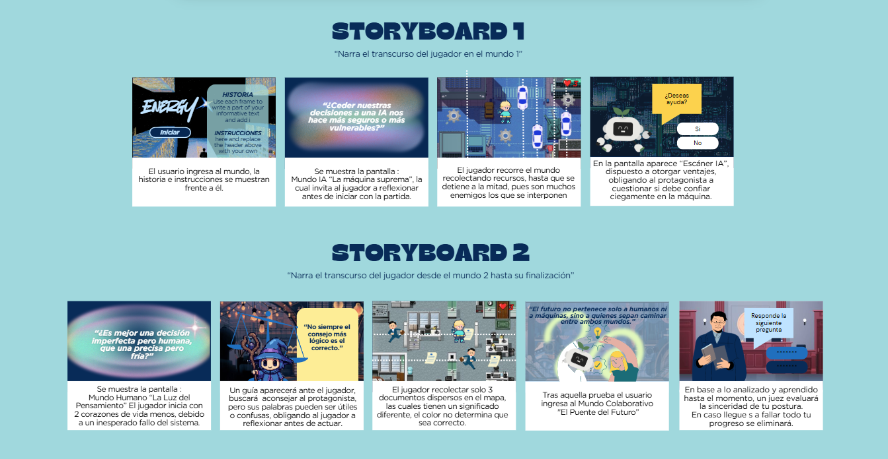
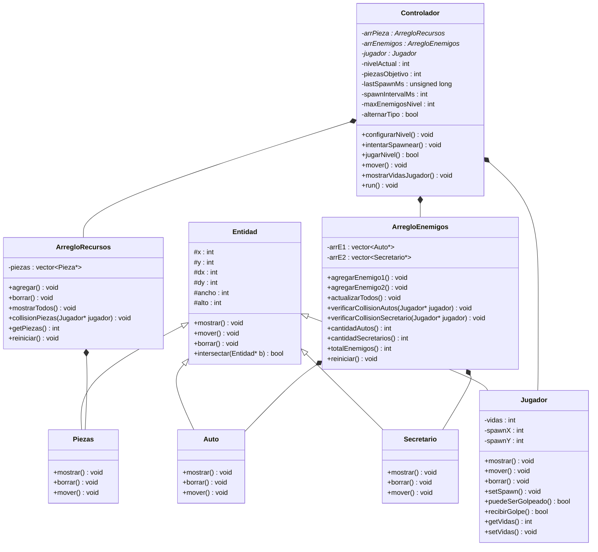
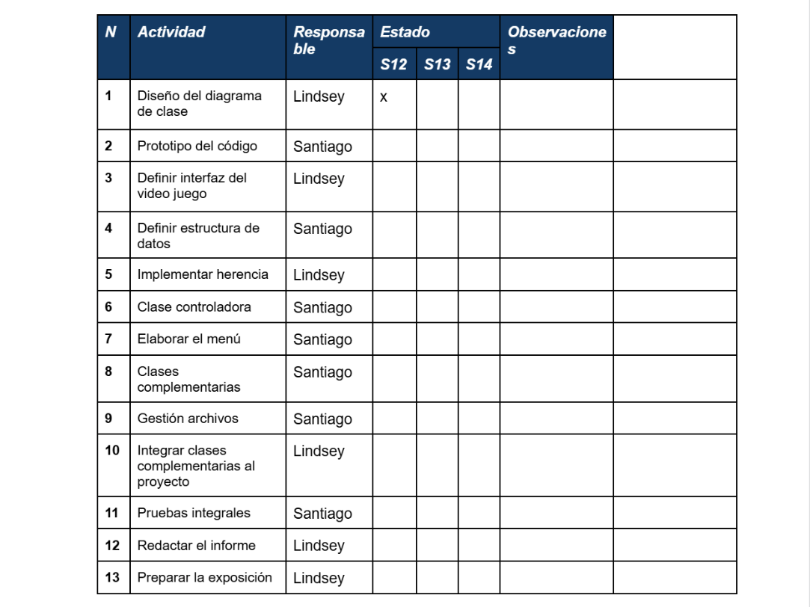

# algoritmos_group01_tf

- Docente: Luis Martin Canaval Sanchez
- Sección:1681

## Integrantes :
- Villamar Rojas Santiago Augusto
- Sebastián Castillo
- Castro Palacios Lindsey Yorget

## Casos:

### Mundo IA – La Máquina Suprema

Diagnóstico con Inteligencia Artificial :
 El uso de la inteligencia artificial en el ámbito médico ha transformado la forma en que se realizan diagnósticos. Los algoritmos de aprendizaje automático permiten procesar imágenes radiológicas con gran precisión, logrando en algunos casos detectar enfermedades en etapas tempranas. Esto representa un beneficio importante para los pacientes, ya que aumenta la probabilidad de un tratamiento oportuno. Sin embargo, la dependencia de la IA plantea riesgos, como la posibilidad de falsos positivos o negativos que pueden afectar la salud de los pacientes. Además, al no existir criterio humano en el proceso, la máquina no considera factores contextuales que podrían ser relevantes para el diagnóstico.
 En el videojuego, este caso puede inspirar un recurso denominado “escáner IA”, que otorga ventajas al jugador al identificar amenazas o problemas, pero que a veces falla, obligando al protagonista a cuestionar si debe confiar ciegamente en la máquina.
 (Revista Vitalia, 2023)

 Vehículos autónomos :
Los automóviles autónomos, desarrollados por empresas como Tesla y Waymo, son un ejemplo de cómo la inteligencia artificial puede tomar decisiones en tiempo real para controlar el tránsito. Estos sistemas utilizan sensores y algoritmos avanzados para interpretar el entorno y decidir acciones como frenar, girar o acelerar. Si bien su eficiencia puede reducir la tasa de accidentes causados por errores humanos, también existen riesgos asociados a fallas de programación o a situaciones imprevistas que la máquina no puede resolver adecuadamente. De hecho, algunos accidentes ocurridos en pruebas han generado debates sobre la responsabilidad legal en caso de fallos.
En el videojuego, este caso puede inspirar un enemigo “auto autónomo” que se mueve de manera rígida y predecible, representando la eficiencia de la máquina, pero también la falta de libertad y adaptabilidad.
(Revista de Iniciación Científica UTP, 2022)

### Mundo Humano – La Luz del Pensamiento

Decisiones judiciales :
En el campo del derecho, muchas decisiones siguen estando exclusivamente en manos de jueces y magistrados. A diferencia de los algoritmos, los jueces aplican su criterio interpretando normas, evaluando pruebas y considerando el contexto social. Este enfoque aporta creatividad e interpretación humana, pero también implica vulnerabilidad, ya que las decisiones pueden estar influenciadas por sesgos, emociones o corrupción. La justicia basada únicamente en humanos pone de relieve tanto la riqueza del juicio crítico como sus limitaciones.
En el videojuego, este caso puede inspirar un personaje juez que actúe como aliado o adversario dependiendo de la situación, mostrando cómo las decisiones humanas pueden ser justas o arbitrarias según el contexto.

Toma de decisiones en psicología :
En la psicología clínica, los profesionales deben elegir el tipo de terapia más adecuada para cada paciente basándose en entrevistas, observación y experiencia previa. Estas decisiones son complejas, pues dependen de factores emocionales, sociales y personales que no siempre son evidentes. La creatividad del psicólogo permite adaptar el tratamiento, pero también existe vulnerabilidad, ya que una mala interpretación puede llevar a errores en la intervención. La ausencia de apoyo tecnológico hace que el peso recaiga totalmente en la intuición y formación del especialista.
En el videojuego, este caso puede inspirar un aliado “psicólogo” que aconseja al protagonista, pero cuyos consejos pueden ser útiles o confusos, obligando al jugador a reflexionar antes de actuar.
(Revista Perspectivas Psicológicas, UASD, 2021)

### Mundo Colaborativo – El Puente del Futuro

Cirugías asistidas por IA :
 El sistema quirúrgico Da Vinci representa un modelo de colaboración entre humanos e inteligencia artificial. En estas cirugías, el robot realiza movimientos de gran precisión, pero siempre bajo el control y supervisión de un cirujano. Esta combinación permite operaciones más seguras y menos invasivas, aunque con un alto costo y la necesidad de un entrenamiento especializado. El caso muestra cómo la colaboración puede potenciar los resultados, pero también revela la incertidumbre que surge cuando la tecnología se convierte en un intermediario de la vida humana.
 En el videojuego, este caso puede inspirar un aliado “robot quirúrgico” que ejecuta tareas precisas, pero que solo funciona correctamente si el jugador da las órdenes adecuadas, reforzando la importancia de la coordinación entre humano y máquina.
 (Universidad Europea, 2023)

Periodismo con IA :
 En el ámbito de la comunicación, el Washington Post implementó la IA “Heliograf” para redactar noticias breves sobre elecciones o resultados deportivos. La máquina generaba borradores rápidos, mientras que los periodistas humanos revisaban, editaban y añadían contexto. Esta colaboración permitió aumentar la productividad, pero también generó debates sobre la calidad y autenticidad de la información producida. El caso refleja cómo la unión entre IA y humanos puede generar eficiencia, aunque siempre con la incertidumbre de hasta qué punto debe confiar en la máquina.
 En el videojuego, este caso puede inspirar un recurso de “información rápida” que el jugador recibe de la IA, pero que debe verificar antes de usar, mostrando el valor del pensamiento crítico frente a datos automáticos.
 (Revista Nueva Época, 2023)

### Conclusiones

El análisis de los seis casos investigados permitió comprender que las decisiones tomadas exclusivamente por la inteligencia artificial, aunque eficientes y rápidas, presentan limitaciones al carecer de un juicio crítico capaz de considerar el contexto. Los diagnósticos médicos automatizados y los vehículos autónomos reflejan esta dualidad: generan beneficios inmediatos, pero también riesgos cuando se confía de manera ciega en la máquina.
En contraste, los casos basados únicamente en decisiones humanas ponen en evidencia tanto la riqueza del pensamiento crítico como su vulnerabilidad. El criterio de los jueces en los tribunales y la toma de decisiones en psicología clínica muestran la importancia de la creatividad y la interpretación subjetiva, pero también revelan la posibilidad de errores derivados de sesgos, cansancio o emociones.
Finalmente, los escenarios de colaboración entre humanos e inteligencia artificial resultan ser los más prometedores, ya que combinan la precisión técnica con la supervisión crítica. Las cirugías asistidas por robots y el periodismo apoyado en IA ejemplifican cómo esta sinergia puede generar resultados más completos, aunque no está exenta de tensiones e incertidumbres.
En conjunto, los casos analizados no solo contribuyen a la reflexión académica, sino que también inspiran el diseño del videojuego propuesto en este trabajo parcial. Cada experiencia real se traduce en personajes, mecánicas e interacciones que permitirán al jugador confrontar dilemas similares, fomentando así la formación de una postura crítica frente al papel de la tecnología en la sociedad contemporánea.

## Storyboard

  

## Diagrama de clases

## Recursos a Utilizar
[📁 ImagenesInforme](ImagenesInforme/)

## Plan de Actividades

  

## Bibliografía

- Cayo, G. A., & Talledo, J. (2023). Diagnóstico asistido por inteligencia artificial: Avances y desafíos en la práctica médica. Revista Vitalia, 1(2), 45-57. https://revistavitalia.org/index.php/vitalia/article/view/183/278

- De León, M., & Ríos, J. (2022). Vehículos autónomos: Perspectivas tecnológicas y desafíos éticos. Revista de Iniciación Científica, 8(1), 33-47. https://revistas.utp.ac.pa/index.php/ric/article/view/1864/2812

- Ferrada, J. (2009). Decisiones judiciales y racionalidad práctica: Una reflexión crítica. Revista Chilena de Derecho, 36(1), 25-48. https://www.scielo.cl/scielo.php?pid=S0718-00122009000100003&script=sci_arttext

- Méndez, A. (2021). La toma de decisiones en la práctica clínica psicológica. Revista Perspectivas Psicológicas, 5(2), 19-32. https://uasd.edu.do/wp-content/uploads/5.-Revista-Perspectivas-Psicologicas.pdf#page=20

- Melgar, P. (2023). Cirugías asistidas por robots: El futuro de la medicina mínimamente invasiva [Trabajo Fin de Grado, Universidad Europea]. Repositorio Universidad Europea. https://titula.universidadeuropea.com/bitstream/handle/20.500.12880/9049/TFG_Paula%20Melgar%20Barcelona.pdf?sequence=1&isAllowed=y

- González, L., & Ramírez, C. (2023). Inteligencia artificial y periodismo: Retos y oportunidades de la automatización de noticias. Revista Nueva Época, 2(3), 101-118. https://nuevaepoca.revistalatinacs.org/index.php/revista/article/view/1682/3582
